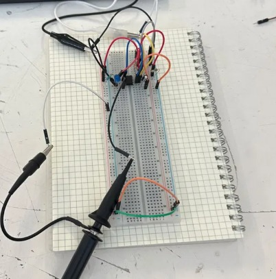
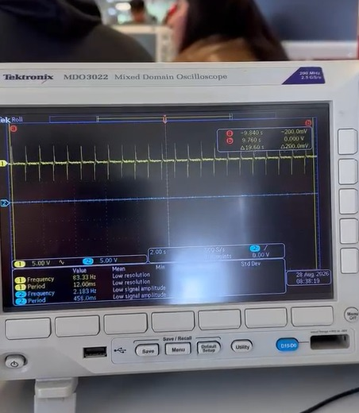

# Sesión 2 — **Prender un LED**

## Qué debía lograr hoy

- [ ] Comprender los conceptos base de electricidad y electrónica (V, I, R, P, AC/DC)
- [ ] Conocer componentes y equipos de medición
- [ ] Evitar errores típicos de montaje y construir un primer circuito funcional con el temporizador 555, midiendo y comparando los resultados con la teoría.

## Qué usé

- 1 × NE555 (DIP-8)
- 1 × LED
- 1 × Resistor para LED (330 Ω o 470 Ω)
- 2 × Resistores temporizadores
- 1 × Capacitor de temporización: electrolítico y otro cerámico para el experimento rápido
- 1 × Capacitor 10 nF para pin 5 (CTRL) → estabilidad
- Protoboard, cables, fuente 5 V regulada

## Qué hice y qué pasó (evidencia)

*Montaje del circuito electrónico en protoboard para la realización de la práctica y medición de las señales.*

*Visualización de la señal generada por el circuito mediante un osciloscopio, mostrando su frecuencia y período.*

## Qué falló y cómo lo resolví

- ***Síntoma:*** No parpadeaba el LED

- ***Cómo lo encontré:*** Después de conectar todo de manera correcta descubrimos que no parpadeaba el LED e investigamos la razón 

- ***Solución:*** El Chip no funcionaba, entonces buscamos otro y al cambiarlo funcionó correctamente.

## Qué aprendí
En esta sesión aprendí a usar un protobard y a conectar distintos elementos dentro de esta para poder hacer parpadear un LED, algo que me ayudarpa mucho para futuros proyectos ya que es lo básico que debo saber, también descubrí los diferentes errores que pueden haber a la hora de hacer circuitos y cómo buscar soluciones.

## Siguiente paso
Investigar más y aprender a usar componentes más avanzados.
