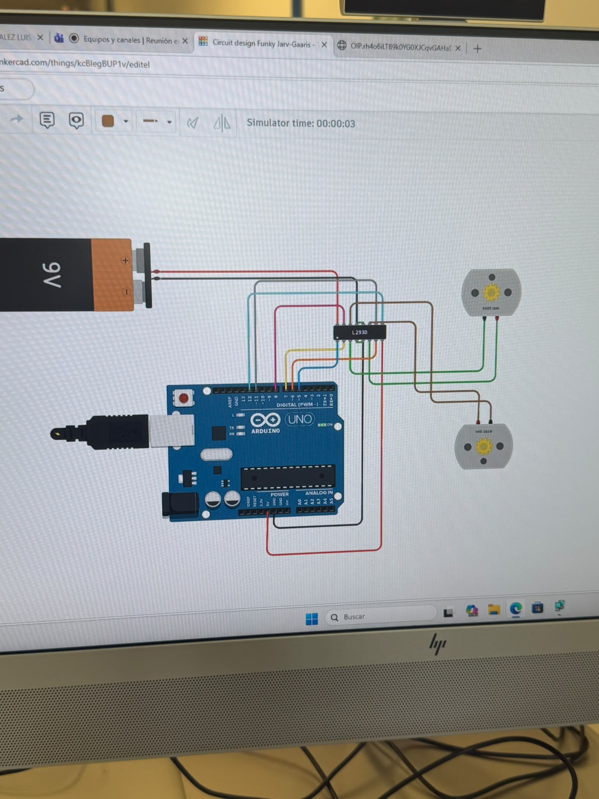
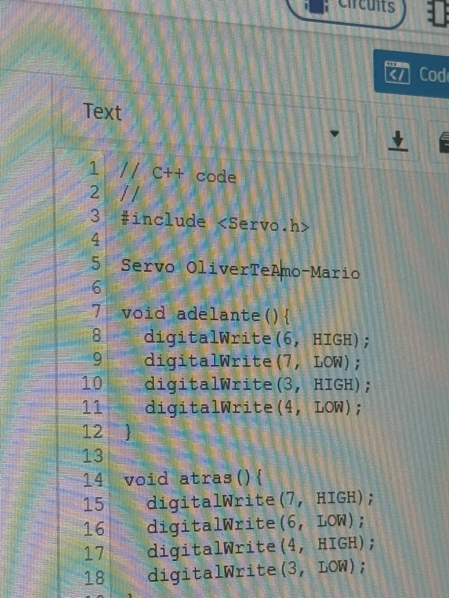

# Sesión 4 — Puente H y sus usos.

## Qué debía lograr hoy

- [ ] Controlar un motor DC con puente H (sentido de giro y velocidad por PWM)
- [ ] Controlar un servo motor con puente H midiendo corriente y comportamiento bajo carga

## Qué usé

- ESP32 DevKit V1 + protoboard y jumpers.
- Driver TB6612 (puente H) y 1–2 motores DC TT con caja reductora.
- Servo SG90 (o similar), potenciómetro de 10 kΩ.
- Fuente/batería para motores separada del ESP32 (con GND común) y multímetro.

## Qué hice y qué pasó (evidencia)

## Qué falló y cómo lo resolví

- ***Síntoma:*** Los motores no giraban adecuadamente
- ***Cómo lo encontré:*** Experimentando con valores y líneas de código encontré que los motores no giraban y se quedaban quietos, al parecer cambié algo en el código que hizo que dejara de funcionar.
- ***Solución:*** Encontré el error, al parecer la página web donde estaba haciendolo estaba trabada, y al reiniciar la página volvió a funcionar perfectamente.

## Qué aprendí
Aprendí sobre los motores, sobre cómo necesitan una fuerza inicial para poder moverse y arrancar como si fuera un carro, cosa que fue curioso por lo menos. También aprendí a usar el Puente H, y eso facilitó el uso de los motores en general.

## Siguiente paso
Descubrir el uso de los motores y las opciones que nos dan.