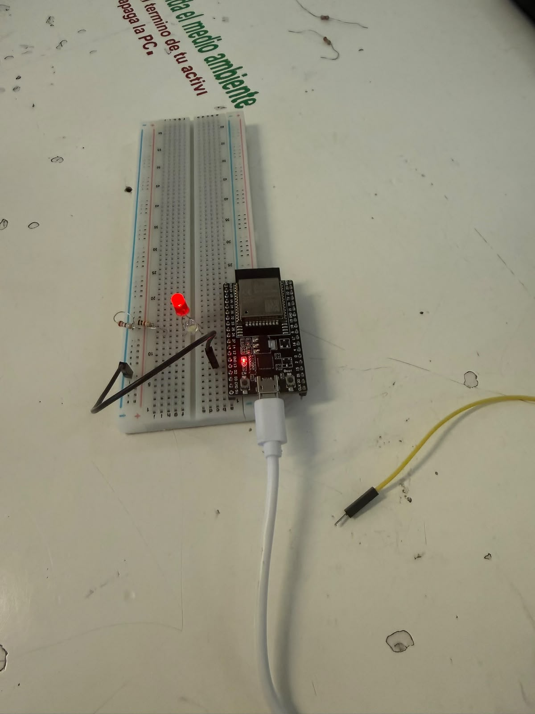
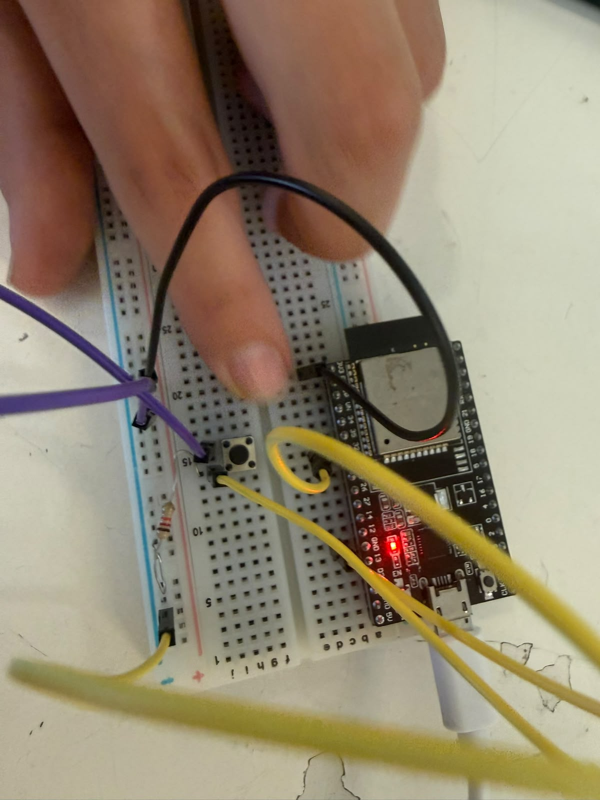
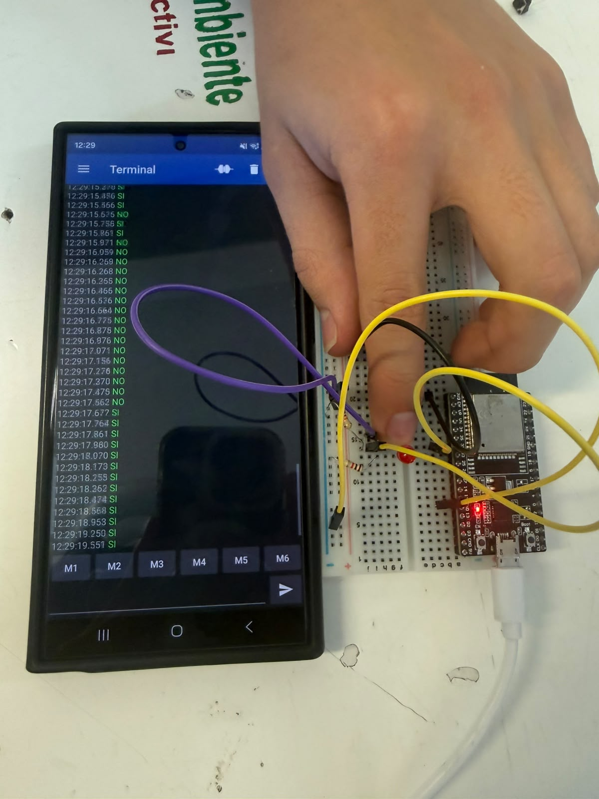

# Sesión 2 — Primer acercamiento ESP32

## Qué debía lograr hoy

- [ ] Configurar el entorno de desarrollo del ESP32
- [ ] Controlar entradas y salidas digitales (LED, botón con pull-up y antirrebote)
- [ ] Establecer comunicación Bluetooth con un protocolo de comandos

## Qué usé
#### Componentes
- **Tarjeta:** ESP32 DevKit V1.
- **Breadboard:** + jumpers.
- **LED:** 1 + 1 resistor 220 Ω.
- **Cable:** USB de datos.
- **Botón:** 1 (Push button).
#### Software
- Arduino IDE + Paquete de tarjetas ESP32.
- App Serial Bluetooth Terminal.

## Qué hice y qué pasó (evidencia)

## Qué falló y cómo lo resolví

- ***Síntoma:*** El LED dejó de funcionar correctamente

- ***Cómo lo encontré:*** Después de experimentar y probar, 
descubrí que el LED no funcionaba del todo bien y a veces no prendía cuando debía o al revés, se apagaba cuando no debía.

- ***Solución:*** Busqué si era fallas en el cableado o en la programación y me dí cuenta que el programa tenía un error de estructura, lo solucione rehaciendo esa parte del programa y al cargarlo de nuevo funcionó correctamente.

## Qué aprendí

En la sesión 2 entendí que los microcontroladores son importantes a la hora de empezar a programar debido a que estos nos facilitan y nos permiten hacer cosas que antes sin ellos no podíamos, como poder conectarlo a nuestro celular y poder ver como hay distintas lecturas que se procesan a través de este microcontrolador.

## Siguiente paso
Una línea: qué sigue antes de la próxima sesión.